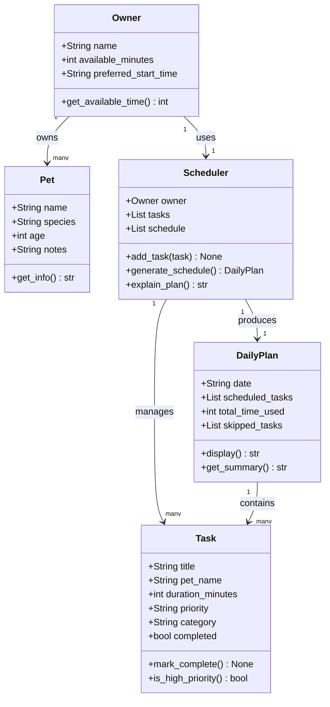

# PawPal+ UML Class Diagram

```mermaid
classDiagram
    class Owner {
        +String name
        +int available_minutes
        +String preferred_start_time
        +get_available_time() int
    }

    class Pet {
        +String name
        +String species
        +int age
        +String notes
        +get_info() str
    }

    class Task {
        +String title
        +String pet_name
        +int duration_minutes
        +String priority
        +String category
        +bool completed
        +mark_complete() None
        +is_high_priority() bool
    }

    class Scheduler {
        +Owner owner
        +List tasks
        +List schedule
        +add_task(task) None
        +generate_schedule() DailyPlan
        +explain_plan() str
    }

    class DailyPlan {
        +String date
        +List scheduled_tasks
        +int total_time_used
        +List skipped_tasks
        +display() str
        +get_summary() str
    }

    Owner "1" --> "many" Pet : owns
    Owner "1" --> "1" Scheduler : uses
    Scheduler "1" --> "many" Task : manages
    Scheduler "1" --> "1" DailyPlan : produces
    DailyPlan "1" --> "many" Task : contains
```
